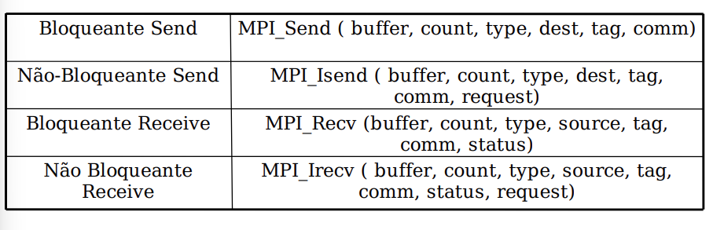

# MPI

## Modelo

Message-Passing é um paradigma de programação baseado em troca de mensagens entre processos, ou seja, é um padrão de interface para bibliotecas de troca de mensagens, pode ser utilizado tanto em memória compartilhada e memória distribuida

- O programador é responsável por identificar o paralelismo
- Existem primitivas de comunicação ponto a ponto e em grupo
- Primitivas de sincronização de processos;
- Primitivas gerências de processos;

## Divido em duas classes:

- MPMD(Multiple Program, Multiple Data)
- SPMD(Single Program, Multiple Data)

### MPMD

- Os processos executam um código diferente sobre um ocnjunto distinto de dados.

### SPMD

- Todos os processos executam o mesmo código sobre um conjunto de dados distinto

# Usando MPICH

- Compilar: mpicc nome.c -o nome

- Executar: mpirun -np _numeroProcessos_ nome

## Codigo: inicializacao

int MPI_Init(int argc, char \*\*argv);

- inicia o ambiente necessário para executar MPI, funciona como uma barreira, logo todos os processos sincronizam nesse trecho antes de iniciarem a execucao.

```
    #include <mpi.h>

    int main(int argc, char **argv){

        MPI_Init (&argc, &argv);

    }
```

## Codigo: finalização

int MPI_Finalize (void)

- Ultima primitiva que deve ser chamada pelos processos, é a barreira que sincroniza o término dos processos.

```
     #include <mpi.h>

    int main(int argc, char **argv){

        MPI_Init (&argc, &argv);
        ...

        MPI_Finalize();

    }
```

## Codigo: identificando o processo e numero de processos

int MPI_Comm_rank (MPI_Comm comm, int \*rank)

Atribuium identificador a cada processo dentro de um determinado grupo, o identificador é um valor de 0 a n-1, onde n é o total de processos

int MPI_Comm_size(MPI_Comm comm, int \*size)

Especifica quantos processos estão presentes no grupo indicado.

```
#include <stdio.h>
#include <mpi.h>

int main(int argc, char **argv){

        int id, nproc;

        MPI_Init(&argc, &argv);

        MPI_Comm_size(MPI_COMM_WORLD, &nproc);
        MPI_Comm_rank(MPI_COMM_WORLD, &id);

        if (id == 0 ) printf("Foram criados %i processos\n", nproc);

        MPI_Finalize();

}
```

# Mensagens entre processos

As mensagens possuem um formato especifico: `|Origem|Destino|Tag|    Dados   |`
e aguardam em uma fila ate serem atendidas, a tag ajuda o processo de destino escolher qual mensagem ele irá retirar da fila.

- Tag: Permite a filtragem de mensagens no destino.

## Troca

int MPI_Send (void \*sndbuf, int count, MPI_Datatype
dtype, int dest, int tag, MPI_Comm comm)

- Para enviar mensagens se usa o MPI_Send, ele manda uma mensagem individual entre um processo e outro.

int MPI_Recv (void \*recvbuf, int count, MPI_Datatype
dtype, int source, int tag, MPI_Comm comm,
MPI_Status status)

- MPI_Recv é usada para recebimento das mensagens no destino, é bloqueante.

```
#include <mpi.h>
#include <stdio.h>
#include <string.h>

int main(int argc, char **argv){

    char mensagem[12];
    int id, quantidadeProcessos, i;

    MPI_Status status;

    MPI_Init(&argc,&argv);

    MPI_Comm_rank(MPI_COMM_WORLD,&id);
    MPI_Comm_size(MPI_COMM_WORLD,&quantidadeProcessos);

    if(id==0){

        strcpy(mensagem,"Hello world");
        for(i = 0 ; i < quantidadeProcessos, i ++){
            MPI_Send(&mensagem,12,MPI_CHAR,i,100,MPI_COMM_WORLD);
        }
    }
    else
    {
        MPI_Recv(&mensagem,12,MPI_CHAR,0,100,MPI_COMM_WORLD,&status);
    }


    printf("\nSou o processo %d: %s\n",id,mensagem);

    MPI_Finalize();

}

```

As rotinas de comunicacao Send e Recv ponto-a-ponto podem ser:

- Bloqueantes: O emissor é bloqueado até o recebimento da mensagem pelo receptor;

- Nao-bloqueantes: O processo emissor envia e continua executando, nesse caso pode ser necessario existir uam verificação se o recebimento já foi efetuado pelo processo de destino.



```
#include <mpi.h>
#include <stdio.h>
#include <string.h>

int main(int argc, char **argv)
{
    char mensagem[12];

    int id, nproc, i;

    MPI_Status status;
    MPI_Request request;

    MPI_Init(&argc, &argv);

    MPI_Comm_rank(MPI_COMM_WORLD, &id);
    MPI_Comm_size(MPI_COMM_WORLD, &nproc);

    if (id == 0)
    {
        strcpy(mensagem, "Ola Mundo");

        for (i = 1; i < nproc; i++)
        {
            MPI_Send(&mensagem,12,MPI_CHAR,i,100,MPI_COMM_WORLD);
        }
    }
    else
    {
        MPI_Irecv(&mensagem,12,MPI_CHAR,0,100,MPI_COMM_WORLD,&request);

         MPI_Wait(&request,&status);
    }

    printf("Sou o processo %i: %s\n", id, mensagem);

    MPI_Finalize();

    return 0;
}
```

# Trabalhando com Pacotes

Os “pacotes” no MPI servem para juntar vários dados diferentes em um único buffer de memória para depois enviar tudo de uma vez.

## Empacotamento de dados

### `MPI_Pack`

```c
int MPI_Pack(void* inbuf,int insize,MPI_Datatype datatype,void* outbuf,int outsize,int* position,MPI_Comm comm);
```

## Desempacotamento de dados

### `MPI_Unpack`

```c
int MPI_Unpack(void* inbuf,int insize,int* position,void* outbuf,int outsize,MPI_Datatype datatype,MPI_Comm comm);
```

## Obtendo o tamanho de um pacote

### `MPI_Pack_size`

```c
int MPI_Pack_size( int incount,MPI_Datatype datatype,MPI_Comm comm,int* size);
```

imagine que um processo precise enviar:

```
int id = 5;
float temperatura = 37.5;
char nome[20] = "sensorA";

```

Não podemos enviar em um unico Send, entao é possivel empacotar tudo:

```
int posicao = 0;

MPI_Pack(&id, 1, MPI_INT, buffer, tamanho, &posicao, MPI_COMM_WORLD);

MPI_Pack(&temperatura, 1, MPI_FLOAT, buffer, tamanho, &posicao, MPI_COMM_WORLD);

MPI_Pack(nome, strlen(nome) + 1, MPI_CHAR, buffer, tamanho, &posicao, MPI_COMM_WORLD);

```

e depois enviar em um Send, indicando que é um pacote:

```
MPI_Send(
    buffer,
    posicao,
    MPI_PACKED,
    destino,
    100,
    MPI_COMM_WORLD
);
```

então o outro processo recebe, e desempacota **na mesma ordem\***:

```
MPI_Recv(
    buffer,
    tamanho,
    MPI_PACKED,
    origem,
    100,
    MPI_COMM_WORLD,
    &status
);
```

```
posicao = 0;

MPI_Unpack(buffer, tamanho, &posicao,
           &id, 1, MPI_INT,
           MPI_COMM_WORLD);

MPI_Unpack(buffer, tamanho, &posicao,
           &temperatura, 1, MPI_FLOAT,
           MPI_COMM_WORLD);

MPI_Unpack(buffer, tamanho, &posicao,
           nome, 20, MPI_CHAR,
           MPI_COMM_WORLD);

```

- MPI_Pack: coloca dados dentro do pacote

- MPI_Unpack tira os dados do pacote

- MPI_Pack_size: calcula quanto espaço o pacote precisa (usamos na variavel tamanho nos exemplos anteriores);
