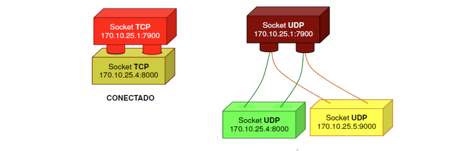
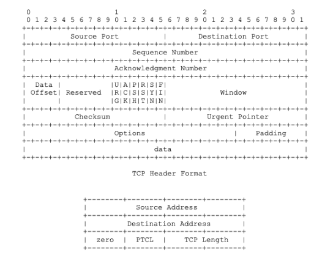
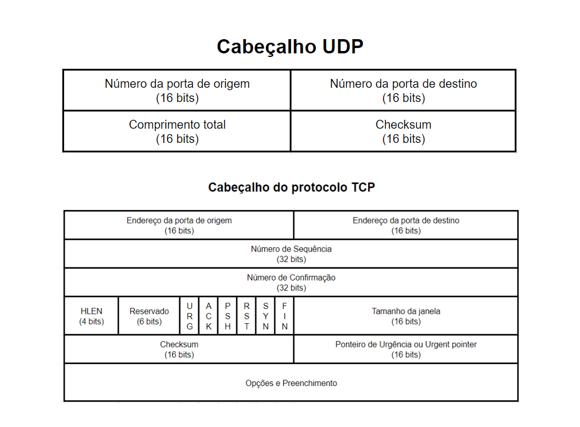

# SOCKETS

- são protocolos pertencentes a camada de transporte 

- implementa comunicação fim a fim entre 2 apliativos(processos) através de uma rede

- O socket é definido pelo seu endereço IP, e o seu protocolo (TCP ou UDP)

- Realizam troca BI-DIRECIONAL de mensagens

- implementado através de duas bases:

    **Send**: não bloqueante

    **Receive**: Bloqueante se não for especificado um timeout.

Ambos transmitem dados brutos.

## BUFFERIZAÇÃO

- O send não é bloquante, portanto é necessário implementar um buffer onde o SO do receptor fica responsável por armazenar em uma fila as mensagens recebidas.

## DIFERENÇAS TCP E UDP

### UDP - User Datagram Protocol

- UDP é não orientado à conexão e pode utilizar unicast, multicast ou broadcast.

### TCP - Transmission Control Procotol

- Orientado a conexão

# TCP (Transmission Control Procotol)

- Protocolo TCP usa um canal confiavel para garantir a entrega dos pcatoes

- Não existe duplicação dos pacotes

- **Garante ordem de entrega** dos pacotes

## Vantagem

- É confiável.

## Desvantagens: 

- TCP é mais lento e apresenta maior sobrecarga, possui um cabeçalho maior (20 bytes em vez de 8 do UDP)

- Precisa confirmar a entrega de cada pacote enviado

## Header

 
# UDP (User Datagram Protocol)

- Implementa um canal não-confiável

- Não garante entrega de pacotes

- Pode entregar pacotes duplicado

- **Não garante ordem de entrega** dos pacotes

## Vantagem

- UDP é mais rápodp que o TCP

## Desvantagens

- Os programas que usam UDP são responsáveis por oferecer a confiabilidade.

## Header

# TCP x UDP 

## Aplicações do TCP:

- Banco de Dados, Envio/Recebimento de Emails, FTP, Acesso a internet via HTTP.

## Aplicações UDp

- Streaming de áudio e vídeo, Fluxo de Dados em tempo real, Multicasting e Broadcasting, em geral serviços que pode ser "aceitável" perder uma quantidade de dados.
